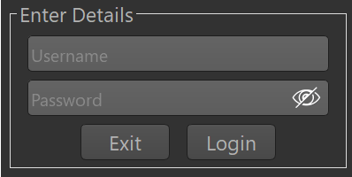
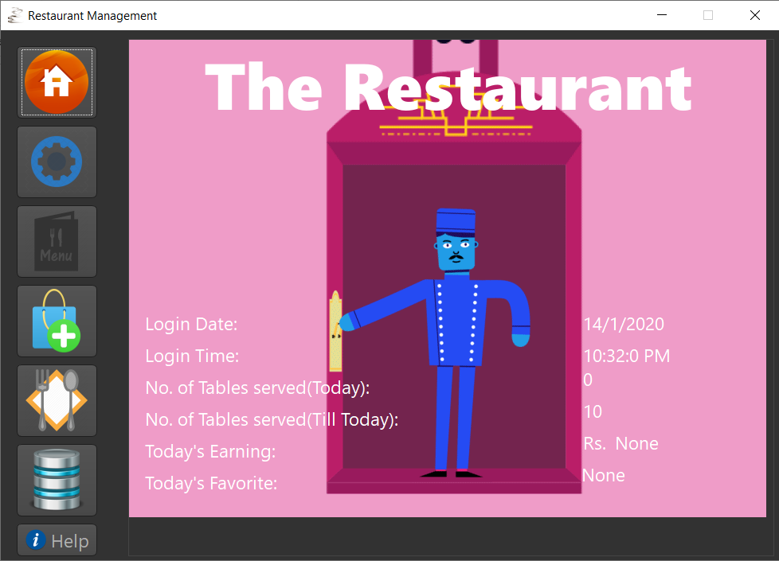

# Restaurant-Management
This a local Restaurant Management Application which makes it possible to store all your menus and giving the ability to edit them anytime to a great extent.The application requires Mysql database(It can be easily downloaded from here: https://dev.mysql.com/downloads/installer/ ).Both python and Mysql work together in this application to provide the best data management and analysis experience.Data can be filtered and stored into excel files for further use.

# Getting Started:
As one executes the "Restaurant Management.exe" file,A login window show up.This window expects the login credentials of your mysql database.

*All the other details regarding the applicaion and its working are included in its help section.*

